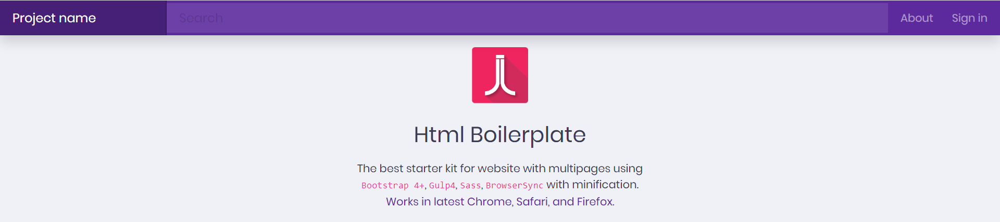

# HTML Boilerplate

[](https://www.hellojagath.com)
[](https://github.com/jagathgj/html-sass-bootstrap-gulp-multipage-boilerplate/blob/master/LICENSE.md)
[](https://github.com/jagathgj/html-sass-bootstrap-gulp-multipage-boilerplate)

<p align="center">
  
</p>

## Intro

The best starter kit for website with multipages using Bootstrap 4, Gulp 4, Sass, BrowserSync with minification.

## Getting Started

Below instructions will help you get a copy of the project up and running on your local machine for starting multipage html development.

### Prerequisites

Install gulp globally on your system

```
npm install gulp -g
```

### Cloning

Clone project from github Repository

```
$ git clone https://github.com/jagathgj/html-sass-bootstrap-gulp-multipage-boilerplate.git
```

### Installing

Then Install the packages included in *package.json*

```
$ npm install
```

### Build

Build for generating pure css/js/fonts/html files in public folder, which is the one to deploy

```
$ npm run build
```

### Run the project - Live on browser

For live development and run the project in browser

```
$ npm run start
```

## Built With

* [Bootstrap 4](https://getbootstrap.com/)
* [Gulp 4](https://gulpjs.com/)
* [Sass](https://sass-lang.com/)

## Authors

* **Jagath Jayakumar** - [Github](https://github.com/jagathgj) - [Official](https://www.hellojagath.com)

## License

This project is licensed under the MIT License - see the [LICENSE.md](LICENSE.md) file for details

## Acknowledgments

* Hat tip to anyone whose code was used
* Inspiration
* Myself
* etc

